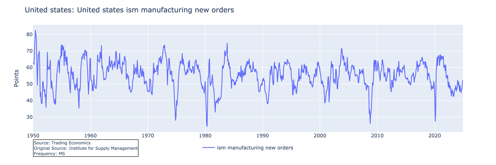

## tedata

Download data from Trading Economics without an account or API key. Trading Economics API costs upwards of $100 USD per month for data access. Using this you will be able to download a large part of the data available on the site for free. Trading Economics has one of the greatest repositories of macroeconomic data on Earth. Download data series into a Jupyter notebook environment or save series directly to an excel file (.xlsx) using command line. This utilizes Selenium and BeautifulSoup4 to scrape data from charts displayed on the site. Should run on linux, mac OS or windows.

Note that the current version (v0.2.0) only supports scraping of data from the economic data type of chart shown on trading economics (example below). The more interactive type chart (second example chart image below) that displays higher frequency data for stocks, commodities etc is not yet working for data download.



**Above:** You can download the data from charts that look like this. The highest frequency data I've seen on these is weekly. I suspect weekly is the highest data frequency accessible via tedata at the moment.


**Above:** You cannot yet download the high frequency data from these types of chart. I'm sure we'll figure out how to do it soon though...

### System Requirements

This package requires a browser that can be automated via selenium. **ONLY FIREFOX BROWSER IS CURRENTLY SUPPORTED**. Ensure that you have the latest stable version of Firefox installed in order to use this package. We should be able to add support for Chrome soon.

- Firefox (version 115.0.0 or higher)
- Python v3.9 or higher.

You can download firefox from: [firefox](https://www.mozilla.org/firefox/new/)

#### Python package requirements:

- plotly
- beautifulsoup4
- selenium
- pandas
- kaleido (optional, for export of plotly fig to image)
- openpyxl (optional, for export of pandas datastructures to excel)

These will be autosmaticaly installed if you use pip to install tedata from pypi.

### Installation

#### Install from pypi

```bash
pip install tedata
```

Ensure that you also have firefox browser installed.

### USAGE

**NOTE:** "prod_tests.ipynb" in the "tests" directory has detailed usage instructions & examples in a jupyter notebook. Refer to that for the best guide.

#### Import tedata

```python
import tedata as ted
```
There are several different ways to use tedata to get data from trading economics:

##### Inside a Jupyter Notebook, python shell or script:

**1.** Use the `search_TE` class from the search module to search for data and then download it.
**2.** Use the trading economics website to locate the data you wish to get. Copy the URL or just the country and indicator names (latter part of URL). Download the data using the `scrape_chart` convenience function (in scraper module) with the URL or country + indicator names.
**3.** Run manually the steps that are performed by the `scrape_chart` function.

##### Using command line

**4.** Use a shell such as bash CLI to download data directly to an .xlsx file using a URL to a Trading Economics chart. Example below will get the data for "ism-manufacturing-new-orders" series for country = "united-states". The flag --head will set the webdriver to not run in headless mode (headless is default). Omit --head to run as headless. Having the head will bring up a browser (firefox) window and you can watch as the scraper does it's thing. It'll take 20 - 40s so this could be more entertaining than waiting. There will be many messages printed to terminal during the scraping action. Once the scraping is complete, the data series and metadata will be saved to an excel file in the current wd. A new window will then open in your default browser to display the interactive plotly chart showing the data.

```bash
python -m tedata "https://tradingeconomics.com/united-states/ism-manufacturing-new-orders" --head
```

### Using Jupyter Notebook or Similar

This is the recommended way to use the package. You will also save time on individual data downloads relative to using the CLI.

#### #1: Search for indicators and download data

```python
# Intialize new search_TE object which uses selenium.webdriver.
search = ted.search_TE()  # Intialize new search_TE object which uses selenium.
# Use the 'search_trading_economics' method to search the home page using the search bar.
search.search_trading_economics("ISM Manufacturing") 

# View top search results. Results are output as a pandas dataframe.
print(search.result_table.head(3))
```

| result | country | metric | url |
|--------|---------|---------|-----|
| 0 | united states | business confidence | [https://tradingeconomics.com/united-states/business-confidence](https://tradingeconomics.com/united-states/business-confidence) |
| 1 | united states | ism manufacturing new orders | [https://tradingeconomics.com/united-states/ism-manufacturing-new-orders](https://tradingeconomics.com/united-states/ism-manufacturing-new-orders) |
| 2 | united states | ism manufacturing employment | [https://tradingeconomics.com/](https://tradingeconomics.com/) |

Scrape data for the second search result using the ```get_data``` method of the search_TE class. This extracts the time-series from the svg chart displayed on the page at the URL. The data is stored in the "scraped_data" attribute of the search_TE object as a "TE_Scraper" object. Data download should take ~30s or so for a reasonable internet connection speed (> 50 Mbps).

```python
search.get_data(1)

# Access the data. The scraped_data attribute is a TE_Scraper object
scraped = search.scraped_data
# The time-series is a pandas series stored in the "series" attribute.
print(scraped.series)

# Plot the series (uses plotly backend). Will make a nice interactive chart in a jupyter notebook. 
scraped.plot_series()

#Export the plot as a static png image. You can use format = "html" to export an interactive chart.
scraped.save_plot(format="png")
```


Metadata for the series is stored in the "metadata" attribte of the TE_Scraper object as a dict and as a pd.Series in the "series_metadata" attribute.

```python
print(scraped.metadata)

{'units': 'points',
 'original_source': 'Institute for Supply Management',
 'title': 'United States ISM Manufacturing New Orders',
 'indicator': 'ism manufacturing new orders',
 'country': 'united states',
 'length': 900,
 'frequency': 'MS',
 'source': 'Trading Economics',
 'id': 'united-states/ism-manufacturing-new-orders',
 'start_date': '1950-01-01',
 'end_date': '2024-12-01',
 'min_value': 24.200000000000998,
 'max_value': 82.6000000000004,
 'description': "The Manufacturing ISM Report On Business is based... ...is generally declining."}
 ```

#### #2: Single line data download

There is a convenience function "scrape_chart"in the scraper module that will run the series of steps needed to download the data for an indicator from Trading Economics. This can be performed with a single line in a jupyter notebook or similar.

```python
#This returns a TE_scraper object with teh data stored in the "series" attribute.
scraped = ted.scrape_chart(URL = "https://tradingeconomics.com/united-states/ism-manufacturing-new-orders")

# Metadata is stored in the "metadata" attribute and the series is easily plotted 
# using the "plot_series" method. 
```

You can then plot your data and export the plot using the "plot_series" and "save_plot" methods as shown above. Export your data using pandas or native python e.g:

```python
# Create Excel writer
with pd.ExcelWriter(filepath) as writer:
    # Save series data
    scraped.series.to_excel(writer, sheet_name='Data')
    # Save metadata
    scraped.series_metadata.to_excel(writer, sheet_name='Metadata')
```

#### #3: Run through the steps individually

Running steps individually can have an advantage in terms of download speed as you can avoid initializing new webdrivers and other objects with every new dataset download. Below we will download data for US corporate profits.

```python
scr = ted.TE_Scraper(use_existing_driver=True)  ## Initialize a new TE_scraper object.
scr.load_page("https://tradingeconomics.com/united-states/corporate-profits"):  # Load the page containing the chart you want to scrape.
```

I've put the steps into separate code cells based upon the time each will take. Making the x-index below is the slow step and ~80% of the time needed to scrape the data is this step.
```python
scr.make_x_index(force_rerun_xlims = True, force_rerun_freqdet = True)  
```
It uses selenium to get data from the tooltips for the first date & last 5 or so dates for the series. From this, frequency can be detrmined & datetime index generated.

```python
scr.get_y_axis(set_global_y_axis=True) ## Get the y-axis tick positions (pixel co-ordinates) and values. 
scr.series_from_chart_soup(set_max_datespan=True)  #Get the series data from path element that is the series trace on the svg chart.
scr.apply_x_index()  ## Apply the x_index to the series, this will resample the data to the frequency of the x_index.
sel.scale_series()  ## Scale the series to the y-axis values to convert the pixel co-ordinates to actual data values.
```

```python
scr.scrape_metadata() ## Scrape the metadata for the data series from the page.
scr.plot_series() ## Plot the series.
```

You can then use the same TE_Scraper object to download other datasets, overwriting the previous data series and metadata. You'd probably want to export the previous data first. Overwriting will be faster than creating a new ```TE_Scraper```. Use the `scrape_chart` function and provide your scraper object as a keyword argument. This will get data for US GDP:

```python
scrape_chart(scraper = scr, id = "gdp", country = "united-states")
```

### Additional Notes

- If not using a headless webdriver instance, i.e a browser window is shown, DO NOT CHANGE ANY SETTINGS ON THE CHART MANUALLY.
- Specifically, changing the chart_type (e.g line chart to bar) cannot be detected as the code stands now (v0.2.0). This could then lead to scraping failures.
- Best to run in headless mode or if running with head, only use the browser window for viewing the actions as they are taken by the webdriver.

### Reporting issues and debugging

The package has extensive logging which should help me identify where things went wrong if you encounter a problem. Please log an issue or pull request and send me your logfile if you run into a problem. logfiles are stored in `/src/tedata/logs`.
